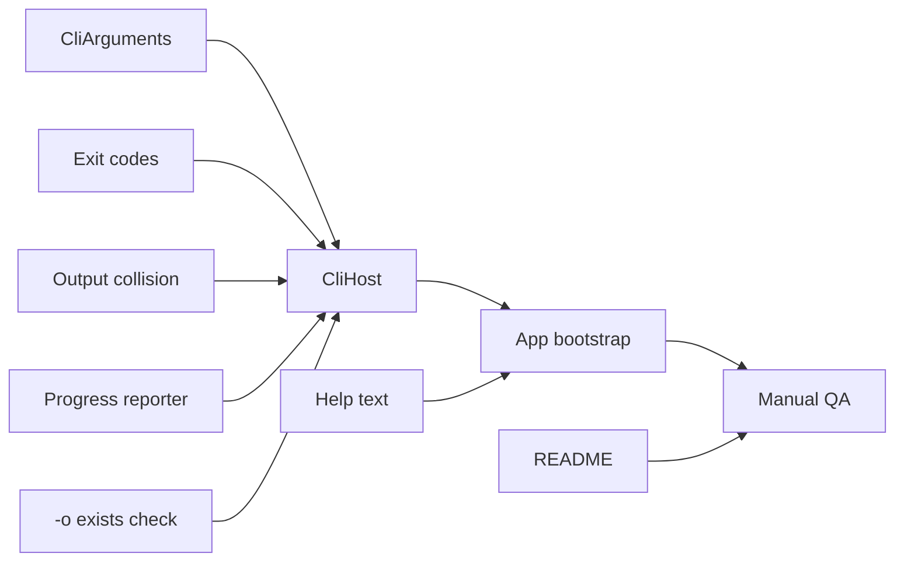

# Implementation plan: Milestone B — CLI Mode

**Source:** [roadmap.md](../roadmap.md) Milestone B  
**Branch:** `feature/milestone-b-cli-mode`  
**Spec folder:** `specs/2026-05-30-cli-mode/`

---

## Task summary

| ID | Role | Description | Estimate |
|----|------|-------------|----------|
| T1 | Dev | B1 — `CliArguments` parser (`-q`, `-s`, `-o`, help, validation) | 1.5 h |
| T2 | Dev | B2 — `CliExitCode` enum + map service/validation failures | 0.5 h |
| T3 | Dev | Default output collision helper (`_compressed_1`, `_2`, …) | 0.75 h |
| T4 | Dev | B3 — `ConsoleProgressReporter` (percent to stderr) | 0.5 h |
| T5 | Dev | B5 — `CliHost.Run()` end-to-end (bootstrap, compress, exit code) | 2 h |
| T6 | Dev | B4 — CLI bootstrap in `App.xaml.cs` (skip WPF when flag detected) | 0.75 h |
| T7 | Dev | B6 — `--help` / `-h` / `/?` usage text with examples | 0.5 h |
| T8 | Dev | Explicit `-o` exists check (exit 1 + error message) | 0.25 h |
| T9 | Dev | README CLI section (syntax, defaults, exit codes, examples) | 0.75 h |
| T10 | QA / Dev | Manual test matrix per validation.md | 1.5 h |
| | | **Total** | **~9 h (~1.25 days)** |

---

## 1. CLI argument parsing (B1) — T1

1. Create `CliArguments` in Core with static `TryParse(string[] args, out CliArguments? parsed, out string? error)`.
2. Support flags: `-q`, `-s`, `-o`, `-h`, `--help`, `/?` (case-sensitive flags per Windows convention).
3. Accept input path as first positional argument or after flags (document chosen rule; prefer first non-flag token).
4. Validate: CRF 18–40, preset in known x264 set, input file exists, `-o` parent directory writable if specified.
5. Apply defaults: CRF 23, preset `medium`, output null → resolved later by host.

**Deliverable:** Parser returns structured args or validation error string suitable for exit code 2.

---

## 2. Exit codes (B2) — T2

1. Create `CliExitCode` enum: `Success = 0`, `GeneralFailure = 1`, `InvalidArguments = 2`, `Cancelled = 3`.
2. Map in `CliHost`: validation → 2, FFmpeg/I/O → 1, success → 0.
3. Reserve 3 for future cancel; CLI v1 does not emit it.

**Deliverable:** Documented mapping consistent with [tech-stack.md](../tech-stack.md).

---

## 3. Output path rules — T3, T8

1. Extend `OutputPathResolver` (or add `ResolveUniqueDefault`) to pick first free path: `{name}_compressed.mp4`, `{name}_compressed_1.mp4`, …
2. In `CliHost`, when `-o` provided: if `File.Exists(output)` → write error to stderr, return exit 1.
3. When `-o` omitted: use unique default resolver before encode.

**Deliverable:** No silent overwrite via CLI; default path never clobbers existing file.

---

## 4. Console progress (B3) — T4

1. Create `ConsoleProgressReporter` implementing progress callback contract used by `CompressionService`.
2. Write `{percent}%` to stderr on change (throttle optional if noisy).
3. No stdout progress in v1.

**Deliverable:** Scriptable runs show progress on stderr without polluting stdout.

---

## 5. CLI host (B5) — T5

1. Create `CliHost.Run(string[] args) → int`.
2. Flow: parse → if help, print usage and return 0 → validate input → resolve output path → `FfmpegBootstrap.EnsureAvailableAsync` → build `CompressionOptions` → `CompressionService.CompressAsync` with reporter → return exit code.
3. Catch exceptions: map `OperationCanceledException` → 3 (future), others → 1 with stderr message.

**Deliverable:** End-to-end headless encode from Core without WPF references.

---

## 6. App bootstrap (B4) — T6

1. In `App.xaml.cs` `OnStartup` (or earlier static entry if needed), detect CLI mode: any recognized flag in `args`.
2. If CLI: `Environment.Exit(CliHost.Run(args))` — do not start WPF application loop.
3. If not CLI: existing WPF startup unchanged.

**Deliverable:** Same exe serves GUI and CLI; no second project/exe required.

---

## 7. Help output (B6) — T7

1. Implement usage text: synopsis, flags table, defaults, exit codes, 2–3 examples.
2. Trigger on `-h`, `--help`, `/?` without requiring input file.
3. Write to stdout; exit 0.

**Deliverable:** `VideoCompressorUI.exe --help` is self-documenting.

---

## 8. Documentation — T9

1. Add **Command-line usage** section to `README.md`.
2. Cover: syntax, defaults, `-o` vs default collision behavior, exit codes, stderr progress note.
3. Examples: minimal encode, custom quality/speed, custom output path.

**Deliverable:** README sufficient for internal script authors (only doc deliverable per D8).

---

## 9. Manual validation — T10

1. Execute all cases in [validation.md](./validation.md).
2. Record pass/fail in PR description or implementation notes (no `implementations/` file required).

**Deliverable:** All validation test cases pass before merge.

---

## Implementation order

Recommended sequence: T1 → T2 → T3 → T4 → T8 → T5 → T7 → T6 → T9 → T10.
