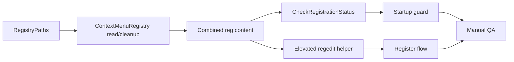

# Implementation plan: Milestone C — Registry Cleanup

**Source:** [roadmap.md](../roadmap.md) Milestone C  
**Branch:** `feature/milestone-c-registry-cleanup`  
**Spec folder:** `specs/2026-05-30-registry-cleanup/`

---

## Task summary

| ID | Role | Description | Estimate |
|----|------|-------------|----------|
| T1 | Dev | C1 — `RegistryPaths` constants (extensions, shell name, key path helpers) | 0.5 h |
| T2 | Dev | C2 — `ContextMenuRegistry` read path + build cleanup `.reg` content | 1 h |
| T3 | Dev | Move `BuildRegContent` install logic into Core; build combined delete+install `.reg` | 1 h |
| T4 | Dev | C3 — `RegisterCtxBtn_Click` uses combined `.reg`, single elevated `regedit /s` | 0.75 h |
| T5 | Dev | C4 — Startup stale-path detection + elevated cleanup `.reg` + UI reset | 1.25 h |
| T6 | Dev | Enhance `CheckRegistrationStatus` — path match required to hide **Register** | 0.5 h |
| T7 | Dev | Shared UI helper — write `.reg` UTF-16 LE + run elevated `regedit /s` (dedupe Register/startup) | 0.5 h |
| T8 | Dev | Document Milestone D installer registry requirement in requirements.md (done in spec) | — |
| T9 | QA / Dev | Manual test matrix per validation.md (path A → B scenario) | 1 h |
| | | **Total** | **~6.5 h (~1 day)** |

---

## 1. Registry path inventory (C1) — T1

1. Create `RegistryPaths` in Core with:
   - `ShellName = "VideoCompressor"`
   - `SupportedExtensions` array: `.mp4`, `.mov`, `.avi`, `.mkv`, `.wmv`, `.flv`, `.webm`, `.m4v`
   - Helpers returning full subkey paths under `HKCR\SystemFileAssociations\{ext}\shell\VideoCompressor` and `\command`
2. Document in XML comments that only `VideoCompressor` shell name is supported (no legacy names per D1).

**Deliverable:** Single source of truth for cleanup and install key paths.

---

## 2. Context menu registry service (C2, C3 partial) — T2, T3

1. Create `ContextMenuRegistry` in Core with:
   - `TryGetRegisteredExePath()` — read and parse command value from `.mp4` key (canonical probe extension).
   - `BuildCleanupRegContent()` — emit `[-HKEY_CLASSES_ROOT\...]` delete lines for every shell key in `RegistryPaths`.
   - `BuildInstallRegContent(string exePath)` — port existing `BuildRegContent` escaping rules (`\\`, `\"`).
   - `BuildCombinedRegContent(string exePath)` — cleanup lines first, then install lines (D9).
2. Path parsing: handle quoted exe in `@"\"C:\path\VideoCompressorUI.exe\" \"%1\""` form; return null if malformed.
3. Path comparison helper: `IsRegisteredForCurrentExe(string currentExePath)` using normalized case-insensitive full paths.

**Deliverable:** Core owns all `.reg` text generation; no WPF/process dependencies.

---

## 3. Register flow update (C3) — T4, T7

1. Refactor `RegisterCtxBtn_Click`:
   - Resolve current exe path (existing logic).
   - Call `ContextMenuRegistry.BuildCombinedRegContent(exePath)`.
   - Write via shared helper: UTF-16 LE to `{BaseDirectory}\install_context_menu.reg`.
   - Single elevated `regedit.exe /s` with `Verb = "runas"`.
2. Remove duplicated `BuildRegContent` from MainWindow (or thin wrapper calling Core).
3. Preserve existing UAC-cancel handling (Win32Exception 1223) and status label messages.

**Deliverable:** Register always refreshes keys idempotently; one UAC prompt per click.

---

## 4. Registration status check — T6

1. Update `CheckRegistrationStatus()`:
   - Call `ContextMenuRegistry.IsRegisteredForCurrentExe(currentExePath)`.
   - **Registered (hide Register):** key exists **and** command path matches current exe.
   - **Not registered (show Register):** key missing, unparseable command, or path mismatch.
2. Status label text:
   - Registered: keep current green success message.
   - Path mismatch (before startup cleanup runs): optional neutral message e.g. *"Explorer menu outdated — click Register to update"* OR same as unregistered (implementation choice: prefer unregistered copy for simplicity).
   - Unregistered: existing prompt text.

**Deliverable:** **Register** button visibility reflects actual path correctness (D6).

---

## 5. Startup stale-path guard (C4) — T5, T7

1. On window loaded (extend existing registration check path):
   - If `TryGetRegisteredExePath()` returns a path **different** from current exe:
     - Build `BuildCleanupRegContent()` only.
     - Write to `{BaseDirectory}\cleanup_context_menu.reg` (or reuse install file name with cleanup-only content — prefer distinct name to avoid confusion).
     - Run elevated `regedit /s` (D4 — UAC on startup).
     - Regardless of exit code (including UAC cancel): call `CheckRegistrationStatus()` → **Register** visible.
2. Do **not** auto re-register after cleanup — user clicks **Register** (D3).
3. If UAC denied: no error dialog required; status shows unregistered state (D5 fallback deferred to Milestone D installer).

**Deliverable:** Stale entries removed when user approves startup UAC; UI always reflects need to re-register after path change.

---

## 6. Elevated regedit helper — T7

1. Extract private helper in MainWindow (or small UI class): `Task<int> ImportRegFileElevatedAsync(string regFilePath)`.
2. Encapsulate `ProcessStartInfo`, `Task.Run`, `WaitForExit`, UAC cancel exception handling.
3. Used by Register and startup cleanup paths.

**Deliverable:** One implementation of elevated import; consistent error handling.

---

## 7. Manual validation — T9

1. Execute all cases in [validation.md](./validation.md).
2. Record pass/fail in PR description (no `implementations/` file per D7).

**Deliverable:** All validation test cases pass before merge.

---

## Implementation order

Recommended sequence: T1 → T2 → T3 → T7 → T6 → T4 → T5 → T9.

---

## Notes

- **Roadmap C5** (store last registered path): satisfied by reading HKCR command value — no new persistence layer.
- **Roadmap C6** test scenario: install/copy to path A, register, copy to path B, launch — old menu gone after startup UAC + re-register from B.
- Do not modify README or create release tag in this milestone (D7).
