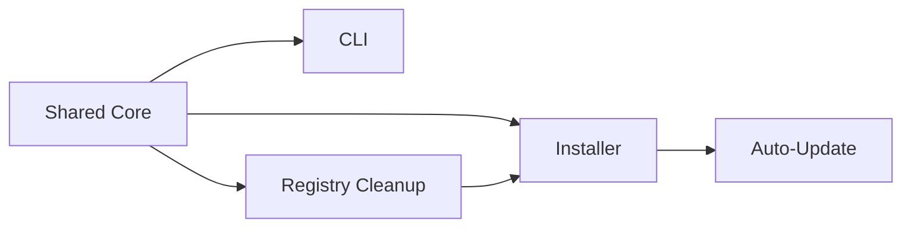

# Roadmap

Phased implementation plan for the stakeholder extension. Each phase is a **single focused task** (~0.5–2 days). Ship **incrementally** — tag and release after each milestone group.

**Priority order:** Shared Core → CLI → Registry → Installer/Updates

Source requirements: [Requirements.md](../Requirements.md)

---

## Milestone A — Shared Core Library

Foundation for CLI, cleaner GUI, and future platforms.

| Phase | Task | Deliverable |
|---|---|---|
| A1 | Create `VideoCompressor.Core` class library (`net8.0`, no WPF) | Empty project referenced by UI |
| A2 | Extract FFmpeg path resolution into `FfmpegLocator` | Single source for exe/ffprobe paths |
| A3 | Extract encode parameters into `CompressionOptions` (CRF, preset, input, output) | POCO with validation |
| A4 | Extract encode execution into `CompressionService` with progress callback | Async method, cancellation support |
| A5 | Wire `MainWindow.xaml.cs` to call `CompressionService` | GUI behavior unchanged; builds green |
| A6 | Extract output path logic (`GetOutputPath`) into Core | Used by GUI and future CLI |
| **Release A** | Tag `v1.1.0` | Internal refactor release; no user-visible change |

---

## Milestone B — CLI Mode

Requirement 1: headless compression from the command line.

| Phase | Task | Deliverable |
|---|---|---|
| B1 | Add `CliArguments` parser in Core (`-q`, `-s`, `-o`, help, validation) | Unit-testable parser |
| B2 | Define exit codes enum and map FFmpeg failures | Documented in tech-stack |
| B3 | Add `ConsoleProgressReporter` (writes percent to stderr) | Implements progress callback |
| B4 | Add CLI host bootstrap in `App.xaml.cs` — skip WPF when CLI flags detected | Headless entry path |
| B5 | Implement `CliHost.Run()` — parse args, call `CompressionService`, set exit code | End-to-end CLI encode |
| B6 | Add `--help` output with usage examples | `-h` / `--help` / `/?` |
| B7 | Manual test matrix: valid args, missing file, bad CRF, bad preset | Test notes in implementations/ |
| **Release B** | Tag `v1.2.0` | CLI available; README updated |

---

## Milestone C — Registry Cleanup

Requirement 2: remove stale context-menu entries on Register and startup.

| Phase | Task | Deliverable |
|---|---|---|
| C1 | Inventory all current + legacy registry key paths in a `RegistryPaths` constants class | Documented key list |
| C2 | Implement `ContextMenuRegistry.Cleanup()` — delete known keys via elevated or user hive as appropriate | Idempotent cleanup |
| C3 | Call cleanup at start of `RegisterCtxBtn_Click` before writing new `.reg` | Register flow fixed |
| C4 | On startup, compare stored install path vs current exe path; cleanup + warn if mismatch | Startup guard |
| C5 | Store last registered exe path in user settings or registry | Enables path-change detection |
| C6 | Test: install to path A, register, move to path B, register again — old menu entry gone | Test notes in implementations/ |
| **Release C** | Tag `v1.2.1` | Registry fix release |

---

## Milestone D — Installer

Requirement 3 (part 1): proper Windows installation.

| Phase | Task | Deliverable |
|---|---|---|
| D1 | Add `installer/VideoCompressor.iss` — Program Files, self-contained publish output | Basic installer script |
| D2 | Include ffmpeg binaries, app icon, Start Menu shortcut | Complete file list |
| D3 | Installer writes install path to registry (for update + context menu) | Machine-readable location |
| D4 | Extend CI workflow to build installer exe alongside zip | CI artifact |
| D5 | Test clean install, reinstall upgrade, uninstall | Test notes in implementations/ |
| **Release D** | Tag `v1.3.0` | First installer release |

---

## Milestone E — Auto-Update

Requirement 3 (part 2): version check and in-place upgrade.

| Phase | Task | Deliverable |
|---|---|---|
| E1 | Add `UpdateConstants.GitHubReleasesUrl` placeholder constant | Config point |
| E2 | Implement `VersionChecker` — fetch latest tag from GitHub releases | Returns version + download URL |
| E3 | Background check on startup (non-blocking, skip if offline) | Silent or toast on new version |
| E4 | Add **Check for updates** to UI (Help menu or settings card) | Manual trigger |
| E5 | Implement `UpdateDownloader` — download release zip/installer to temp | Progress in UI |
| E6 | Implement `UpdateApplier` — cmd script: extract, close app, replace install dir, restart | In-place upgrade |
| E7 | Remove superseded files after successful update | No orphan old binaries |
| E8 | Test full cycle: v1.3.0 installed → detect v1.3.1 → auto-update | Test notes in implementations/ |
| **Release E** | Tag `v1.4.0` | Auto-update enabled (set real GitHub URL first) |

---

## Dependency Graph

Registry cleanup (C) should land before or alongside installer (D) so installed paths and context menu keys stay consistent. Auto-update (E) depends on installer (D) knowing the install directory.

---

## Release Summary

| Tag | Milestone | User-visible change |
|---|---|---|
| v1.1.0 | A — Shared Core | None (refactor) |
| v1.2.0 | B — CLI | Command-line compression |
| v1.2.1 | C — Registry | Fixed stale Explorer menu entries |
| v1.3.0 | D — Installer | Inno Setup installer |
| v1.4.0 | E — Auto-Update | Check + in-place upgrade |

---

## Before Starting

- [ ] Replace `UpdateConstants.GitHubReleasesUrl` placeholder with real repo URL (phase E1/E8 gate)
- [ ] Confirm legacy registry key paths with anyone who deployed older builds (phase C1)
- [ ] Install Inno Setup 6 on dev machine and CI runner (phase D1)

## Related Documents

- [mission.md](./mission.md) — scope and success criteria
- [tech-stack.md](./tech-stack.md) — CLI contract, exit codes, installer details
- [Requirements.md](../Requirements.md) — stakeholder source
- [implementations/](../implementations/) — per-phase implementation notes (created as work completes)
